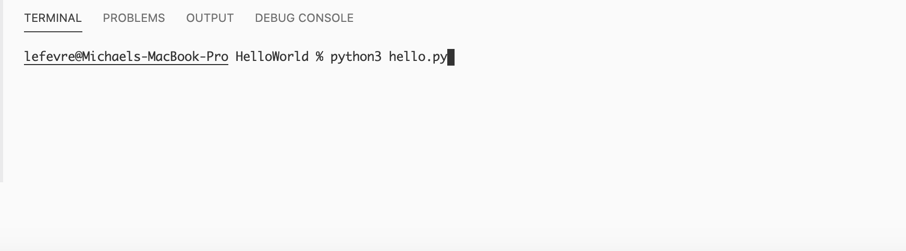
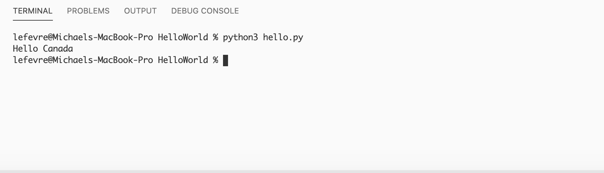

# Hello World Program

## Overview
This program says hello to my neightbor, Canada!

## Development Environment
Vision Studio Code 
Python 3.8.0 64 bit 

## Execution 
To execute the program: `python3 hello.py` 

 

## Useful Websites 
